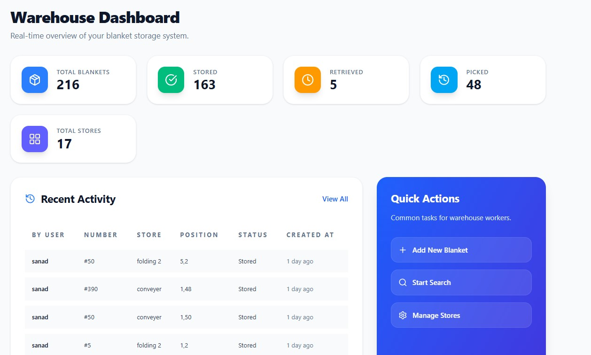

# 🧺 نظام إدارة تخزين الغسيل - Laundry Storage Management V3

**المطور:** [sanadgit](https://github.com/sanadgit)

نظام متقدم لإدارة ومراقبة تخزين الملابس والغسيل مع واجهة ثلاثية الأبعاد وتخزين البيانات السحابي.

---

## 📋 نبذة عن المشروع

يوفر هذا المشروع حلاً متكاملاً لإدارة المستودعات والتخزين مع:
- 📦 إدارة المخزون والتخزين الفعال
- 🎯 عرض ثلاثي الأبعاد (3D) للمستودع
- 🔍 نظام بحث متقدم عن المنتجات
- 📊 لوحة تحكم شاملة للمراقبة
- ☁️ تخزين البيانات السحابي (Supabase)
- 🎨 واجهة مستخدم حديثة وسهلة الاستخدام

---

## � لقطات المشروع

### لوحة التحكم
عرض فوري لنظام تخزين الغسيل الخاص بك مع المقاييس الرئيسية والأنشطة الأخيرة.



### إدارة المستودع
إدارة الملابس وتكوينات التخزين مع إجراءات سريعة وإحصائيات شاملة.


### عرض ثلاثي الأبعاد والبحث
تصور ثلاثي الأبعاد تفاعلي للمستودع مع بحث متقدم وإدارة طبقات الشبكة.


---

## �🛠️ المتطلبات

- **Node.js** (الإصدار 16 أو أحدث)
- **npm** أو **yarn**
- حساب **Supabase** (اختياري - للتخزين السحابي)

---

## 🚀 التثبيت والتشغيل

### 1. استنساخ المستودع
```bash
git clone https://github.com/sanadgit/LAUNDRY-storage-management-V3.git
cd LAUNDRY-storage-management-V3
```

### 2. تثبيت المكتبات
```bash
npm install
```

### 3. إنشاء ملف `.env` المحلي
أنشئ ملف `.env` في جذر المشروع بناءً على `.env.example`:
```env
VITE_SUPABASE_ENABLED=true
VITE_SUPABASE_URL=your_supabase_url
VITE_SUPABASE_ANON_KEY=your_supabase_anon_key
```

### 4. تشغيل التطبيق
```bash
npm run dev
```

سيتم فتح التطبيق على `http://localhost:5173`

---

## 📂 هيكل المشروع

```
src/
├── components/        # مكونات React
├── context/          # إدارة الحالة
├── constants/        # الثوابت والإعدادات
├── lib/              # المكتبات والعملاء
├── pages/            # الصفحات الرئيسية
├── server/           # سكريبتات الخادم
├── store/            # إدارة المتجر
└── utils/            # دوال مساعدة
```

---

## 🎯 المميزات الرئيسية

- ✅ **إدارة المستودع**: تنظيم وتتبع المنتجات
- ✅ **عرض 3D**: تصور مرئي للمستودع
- ✅ **نظام البحث**: البحث السريع عن المنتجات
- ✅ **لوحة التحكم**: تقارير وإحصائيات فورية
- ✅ **التكامل السحابي**: Supabase للبيانات الموثوقة

---

## 🔧 الأوامر المتاحة

- `npm run dev` - تشغيل الخادم التطويري
- `npm run build` - بناء التطبيق للإنتاج
- `npm run preview` - معاينة البناء الإنتاجي

---

## 📦 المكتبات المستخدمة

- **React 18** - مكتبة واجهة المستخدم
- **TypeScript** - لغة البرمجة بأمان النوع
- **Vite** - أداة البناء السريعة
- **Supabase** - قاعدة البيانات السحابية
- **Three.js** - رسوميات ثلاثية الأبعاد

---

## 📝 الترخيص

هذا المشروع مرخص تحت **MIT License** - وهي رخصة مفتوحة المصدر تسمح بالاستخدام الحر للمشروع.
انظر ملف [LICENSE](LICENSE) للتفاصيل الكاملة.

---

**تم آخر تحديث:** 17 أبريل 2026
